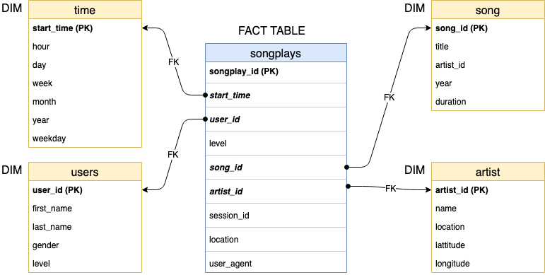
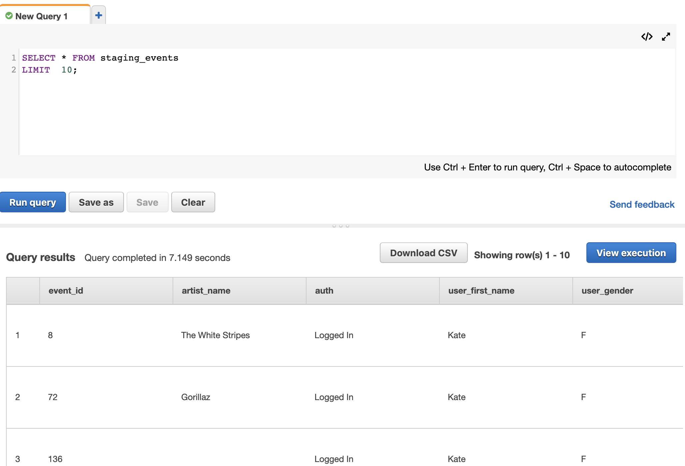

### Project 3

# Data Warehouse with AWS

> June 04, 2019
> Author: Natalia Meleshkina

## Summary of the project

Sparkify (music streaming startup, that we worked earlier) has grown their user base and song database and want to move their processes and data onto the cloud. Their data resides in S3, in a directory of JSON logs on user activity on the app, as well as a directory with JSON metadata on the songs in their app.

To accomplish this task we are going to build ETL pipeline to load their data from S3 to the staging tables on Redshift.
Next, we transform staging data  to Data Warehouse addimensional tables for their analytics team to continue finding insights in what songs their users are listening to.

## Data

Sparkify shared two datasets on Amazon S3. 

1. Song dataset consists of JSON files and contains metadata about a song and the artist of that song. The files are partitioned by the first three letters of each song's track ID.

- Song data: `s3://udacity-dend/song_data`

2. Log dataset. Contains app activity logs from streaming app. The log files in the dataset are partitioned by year and month.

- Log data: `s3://udacity-dend/log_data`

Log data JSON path: `s3://udacity-dend/log_json_path.json`

To locate each song play, we filter records by `page = NextSong` in our queries. 

## DB Schema

We implemt star schema for **sparkify** database on Redshift/Postgres. It contains one fact table of songplays and four dimension tables for users, song, artist, and time.

This schema is not fully normalized, as the `level` feature is replicated in the songplays fact table as well as the users dimension table. It’s structure will allow queries to be optimized for song play analysis, with simpler joins and aggregations. All essential data for songplays and user level is contained in the songplays fact table.

## Project structure

Under our project folder we have following files: 

- **create_table.py** contains script to create fact and dimension tables in Redshift.
- **Redshift_mgmt.ipynb**  contains number of actions to work with cluster with programmatic access
- **etl.py** - script which loads data from S3 into staging tables on Redshift and then process that data into Redshift for  analytics.
- **dwh.cfg** - contains configuration information to set up and connect to Redshift cluster
- **sql_queries.py** contains SQL statements definitions, which will be imported into the two other files above.

### Setting environment

To run project locally you need Anaconda installed. You can find recent package and installation guides here:

- <a href="https://www.anaconda.com/distribution/">Anaconda for Python</a>

We also going to need two libraries installed for our script - **Pandas** (to be able to create dataframe or read CSV file) 

To instal Pandas, run in Terminal:
> conda install pandas

### How to run

1. Navigate to Project directory via Terminal(Shell/Command line) and run command:

> jupyter notebook

2. In the openned directory find **Redshift_mgmt.ipynb** and open it.
Read instructions and run cells until step 3.2 "Retreive clusters ENDPOINT and ROLE_ARN"

3. From Jupyter root directory open file dwh.cgf. Take values of clusters ENDPOINT and ROLE_ARN from the previous step and paste them into host and ARN variables respectively 

~~~~
[CLUSTER]
host = dwhcluster.[...].us-west-2.redshift.amazonaws.com
...
~~~~

~~~~
[IAM_ROLE]
iam_role_name = dwhRole
ARN='arn:aws:iam::[...]:role/dwhRole'
~~~~

4. Return to the **Redshift_mgmt.ipynb** and run cell with Step 4 to establish TCP connection.

5. With Terminal(Shell/Command line) in the project directory run below command:

> python create_tables.py

This will script will connect to Redshift and create required staging, fact, and dimentions tables

5. Next, run command:

> python etl.py

This is ETL sctipt that loads data to staging and then to fact and dim tables. 
Note. this process might take some time. You might login to your AWS to monitor ETL status.  

6. Once ETL completed you can navigate to AWS cluster Query Editor and perfom some SQL queries to validate consistancy or perform analyses 

7. In order to avoid billing for using cluster resources run Step 5 in the **Redshift_mgmt.ipynb** 